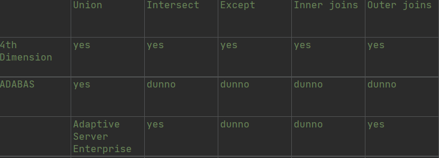

# Extractors evaluation
During this project, two types of extractors has been made. One of them extract tables from HTML code. 
The other extract from WikiText code. We have to compare the performance of the two extractors. 
The first comparison will be on the number of URL processed. 
The other comparison will be on the quality of the extraction.

## Number of extraction

Like we said before, we have to compare the number of good extraction.
There is 303 URL processed for 336 in total, so 90.2% of success

### Comparison

|HTML Extraction|WikiText Extraction|
|:----------:|:---------:|
|1657|1049|
 
## List of problems
|<h3>Problems </h3>| <h3>HTML Extractor</h3>       |  <h3>Wikitext Extractor</h3>  |
|:---------------:|:------------:|:------------:| 
|Bad extract of headers of rows| X ||
|When the value of cells is a link, it extract the content| X ||
|Merged cells create a new column for each rows| X | X |
|When cells are merged, only one row include the value| X | X |
|Some cells in colors extract the color attribute|| X |
|When the value of cells is "?", it extract "dunno"| | X |
|Link in exponent extract the date of the article | | X |
|Some title of row were shifted or deleted| | X |
|Presence of picture in cells, extract her size| | X |

### Problems explanation

#### Heads of rows

On the HTML extractor, there is a problem for the header extraction of rows.

Below, you can see first the good extraction with WikiText extractor :

```
Present tense infinitive,-ar (irar)
Past tense infinitive,-ir (irir)
Future tense infinitive,-or (iror)
```

And now, this is the result of the HTML Extractor : 

```
Infinitive,-ar (irar)
Infinitive,-ir (irir)
Infinitive,-or (iror)
```

With HTML, there isn't an entire extraction of headers row.

#### Link cells

Sometimes, contributors of Wikipedia can link a value to an other Wikipedia page.
Like header's row, HTML extract doesn't work but WikiText extract, yes.

WikiText result (right): 

```
IPA phonemes,a,b
```

HTML result : 

```
International Phonetic Alphabet International Phonetic Alphabet,Open front unrounded vowel,Voiced bilabial plosive
```

#### Merged cells : Problem 1 and 2

When the table contains merged cells, for HTML and WikiText extractors, they don't support this.
For example if these extractors work, the CSV return will be :

```
to be going,to go,-anti (iranti),-i (iri)
to have gone,to go,-inti (irinti),
to be going to go,to go,-onti (ironti),
```

But the result for two extractors is : 

```
to be going,to go,-anti (iranti),-i (iri)
to have gone,,-inti (irinti)
to be going to go,,-onti (ironti)
```

Indeed, there is the good value for the first row, but the others have a blank. So, when Wikipedia table contains merged cells, a new column (or row) is added.

The problem is, with the good extraction, the table will look like 3 cells separated, but not merged.

#### HTML attributes

For the extraction with HTML code, there is a bug which isn't recurring. 
Extractor extract, sometimes, HTML attributes. Exemple : 

```
irgatempe,|nulatempe,,style="background: #d8ffd8" | omnatempe, sempre
``` 

#### Manage of "?"

As we know, the WikiText language is not the same for each contributor.
So, the extractor will work with all specifical cases. In this exemple
we can see in the WikiText editor, there is a "dunno" for a "?"

```
Qhub,dunno,dunno,dunno,dunno
```

In the WikiText editor, the "?" is a "dunno", so it will be difficult to repair that.

#### Extra-comma

In the WikiText extractor, sometimes, it add a comma in the beginning of each row.
There is the Wikipedia version : 


and the extractor version : 



In the third row, the header is on the second cell.

#### Pictures problems 

When a Wikipedia table contains pictures, there is the same probleme for attributes.
The extractor take pictures attributes and writes them on CSV cell.

For example, in a good part of the next table, the value is the dimension of Wikipedia pictures : 

